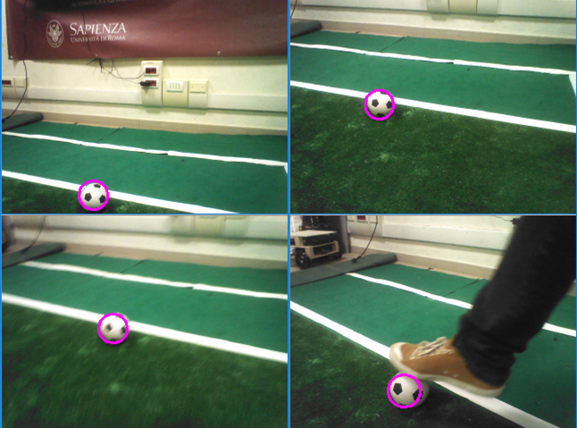

# detectball
detectball is a software for detecting the RoboCup SPL black and white ball in images captured by NAO robots - Copyright 2017 Domenico Daniele Bloisi

detectball is part of the tutorial "How to Use OpenCV for Ball Detection" by Domenico D. Bloisi (http://web.unibas.it/bloisi/tutorial/balldetection.html) and it is distributed under the terms of the GNU Lesser General Public License (Lesser GPL)

### Prerequisites

You need to have OpenCV 4.3 installed to compile and run the code

### Build the code

```
mkdir build
cd build && cmake ..
make
```

### Run the code

```
detectball test
```

where test is a folder containing images.

### Examples



Please, report bugs to domenico.bloisi@gmail.com
